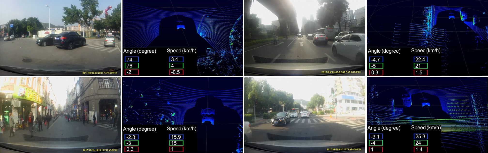

[DBNet](http://www.dbehavior.net/) is a __large-scale driving behavior dataset__, which provides large-scale __high-quality point clouds__ scanned by Velodyne lasers, __high-resolution videos__ recorded by dashboard cameras and __standard drivers' behaviors__ (vehicle speed, steering angle) collected by real-time sensors.

Extensive experiments demonstrate that extra depth information helps networks to determine driving policies indeed. We hope it will become useful resources for the autonomous driving research community.

_Created by [Yiping Chen*](https://scholar.google.com/citations?user=e9lv2fUAAAAJ&hl=en), [Jingkang Wang*](https://wangjksjtu.github.io/), [Jonathan Li](https://uwaterloo.ca/mobile-sensing/people-profiles/jonathan-li), [Cewu Lu](http://www.mvig.org/), Zhipeng Luo, HanXue and [Cheng Wang](http://chwang.xmu.edu.cn/). (*equal contribution)_

The resources of our work are available: [[paper]](http://openaccess.thecvf.com/content_cvpr_2018/papers/Chen_LiDAR-Video_Driving_Dataset_CVPR_2018_paper.pdf), [[code]](https://github.com/driving-behavior/DBNet), [[video]](http://www.dbehavior.net/data/demo.mp4), [[website]](http://www.dbehavior.net/), [[challenge]](http://www.dbehavior.net/task.html), [[prepared data]](https://drive.google.com/file/d/1WxzOrhvMnHCOkh6EFGWltflyPb_UnGqo/view?usp=sharing)

<!--
## News!
__DBNet Autonomous Driving Data (prepared & raw) are released [here](http://www.dbehavior.net/download.aspx)!__
___We are going to organize DBNet challenges for CVPR/ICCV/ECCV Workshops. The instructions of DBNet-2018 challenge will be open soon. Stay tuned!___
-->

## Contents
1. [Introduction](#introduction)
2. [Requirements](#requirements)
3. [Quick Start](#quick-start)
4. [Baseline](#baseline)
5. [Contributors](#contributors)
6. [Citation](#citation)
7. [License](#license)

## Introduction
This work is based on our [research paper](http://openaccess.thecvf.com/content_cvpr_2018/html/Chen_LiDAR-Video_Driving_Dataset_CVPR_2018_paper.html), which appears in CVPR 2018. We propose a large-scale dataset for driving behavior learning, namely, DBNet. You can also check our [dataset webpage](http://www.dbehavior.net/) for a deeper introduction.

In this repository, we release __demo code__ and __partial prepared data__ for training with only images, as well as leveraging feature maps or point clouds. The prepared data are accessible [here](https://drive.google.com/open?id=14RPdVTwBTuCTo0tFeYmL_SyN8fD0g6Hc). (__More demo models and scripts are released soon!__)

## Requirements

* **Tensorflow 1.2.0**
* Python 2.7
* CUDA 8.0+ (For GPU)
* Python Libraries: numpy, scipy and __laspy__

The code has been tested with Python 2.7, Tensorflow 1.2.0, CUDA 8.0 and cuDNN 5.1 on Ubuntu 14.04. But it may work on more machines (directly or through mini-modification), pull-requests or test report are well welcomed.

## Quick Start
### Training
To train a model to predict vehicle speeds and steering angles:

    python train.py --model nvidia_pn --batch_size 16 --max_epoch 125 --gpu 0

The names of the models are consistent with our [paper](http://www.dbehavior.net/publications.html).
Log files and network parameters will be saved to `logs` folder in default.

To see HELP for the training script:

    python train.py -h

We can use TensorBoard to view the network architecture and monitor the training progress.

    tensorboard --logdir logs

### Evaluation    
After training, you could evaluate the performance of models using `evaluate.py`. To plot the figures or calculate AUC, you may need to have matplotlib library installed.

    python evaluate.py --model_path logs/nvidia_pn/model.ckpt

### Prediction
To get the predictions of test data:

    python predict.py

The results are saved in `results/results` (every segment) and `results/behavior_pred.txt` (merged) by default.
To change the storation location:

    python predict.py --result_dir specified_dir

The result directory will be created automatically if it doesn't exist.

## Baseline
<table style="undefined;table-layout: fixed; width: 512px"><colgroup><col style="width: 68px"><col style="width: 106px"><col style="width: 66px"><col style="width: 88px"><col style="width: 54px"><col style="width: 46px"><col style="width: 38px"><col style="width: 46px"></colgroup><tr><th>Method</th><th colspan="2">Setting</th><th>Accuracy</th><th>AUC</th><th>ME</th><th>AE</th><th>AME</th></tr><tr><td rowspan="2">nvidia-pn</td><td rowspan="2">Videos + Laser Points</td><td>angle</td><td>70.65% (&lt;5)</td><td>0.7799 </td><td>29.46</td><td>4.23</td><td>20.88</td></tr><tr><td>speed</td><td>82.21% (&lt;3)</td><td>0.8701</td><td>18.56</td><td>1.80</td><td>9.68</td></tr></table>

This baseline is run on __dbnet-2018 challenge data__ and only __nvidia\_pn__ is tested. To measure difficult architectures comprehensively, several metrics are set, including accuracy under different thresholds, area under curve (__AUC__), max error (__ME__), mean error (__AE__) and mean of max errors (__AME__).

The implementations of these metrics could be found in `evaluate.py`.

## Contributors
DBNet was developed by [MVIG](http://www.mvig.org/), Shanghai Jiao Tong University* and [SCSC](http://scsc.xmu.edu.cn/) Lab, Xiamen University* (*alphabetical order*).

## Citation
If you find our work useful in your research, please consider citing:

	@InProceedings{DBNet2018,
	  author = {Yiping Chen and Jingkang Wang and Jonathan Li and Cewu Lu and Zhipeng Luo and HanXue and Cheng Wang},
	  title = {LiDAR-Video Driving Dataset: Learning Driving Policies Effectively},
	  booktitle = {The IEEE Conference on Computer Vision and Pattern Recognition (CVPR)},
	  month = {June},
	  year = {2018}
	}

## License
Our code is released under Apache 2.0 License. The copyright of DBNet could be checked [here](http://www.dbehavior.net/contact.html).
